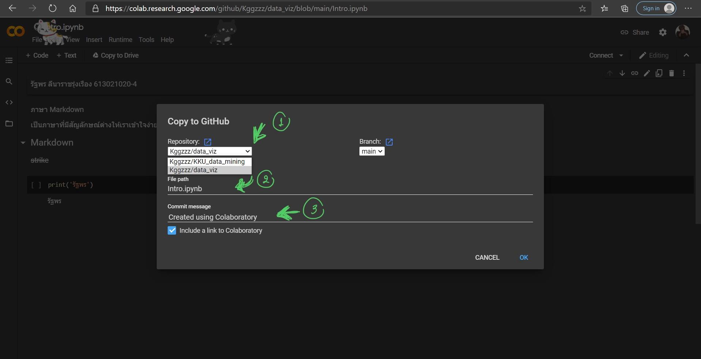
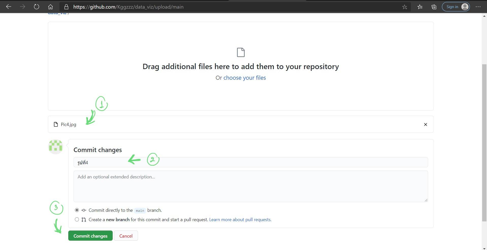

# data_viz

รัฐพร ลีนาราชรุ่งเรือง 613021020-4

#(1) 
เขียนขั้นตอนการเซฟไฟล์จาก Colab ลงใน github
เขียนขั้นตอนตัวอย่างการอัพโหลดรูปลง 

1.เมื่อพิมงานใน Google Colab เสร็จแล้วให้กดที่คำว่า _File_ จากนั้นเลือกที่คำว่า _Save a coppy in GitHub_

2.เมื่อกดเสร็จแล้วให้เลือกโปรเจคที่ต้องการจะ _Save_ ในครั้งนี้เราจะเลือกเป็น _data_vis_ จากนัั้นตรงช่อง _Commit message_ แล้วตั้งชื่อที่ต้องการจะcommit สุดท้ายจึงกด _OK_ 

ตัวอย่างการแทรกรูป

#(2) 
เขียนขั้นตอนการแทรกรูป

1. กดที่คำว่า _Add file_ จากนั้นเลือกที่ _Uplode file_

2. จากนั้นกดที่ _choose your file_ แล้วเลือกรูปภาพที่ต้องการอัพโหลด กด _Open_ เพื่อเรียกรูป

3. จากนั้นจะเห็นว่ารูปที่ต้องการแทรกถูกเรียกมาแล้ว แล้วเราก็สามารถเปลี่ยนชื่อ Commit ได้ตรง _Commit changes_

