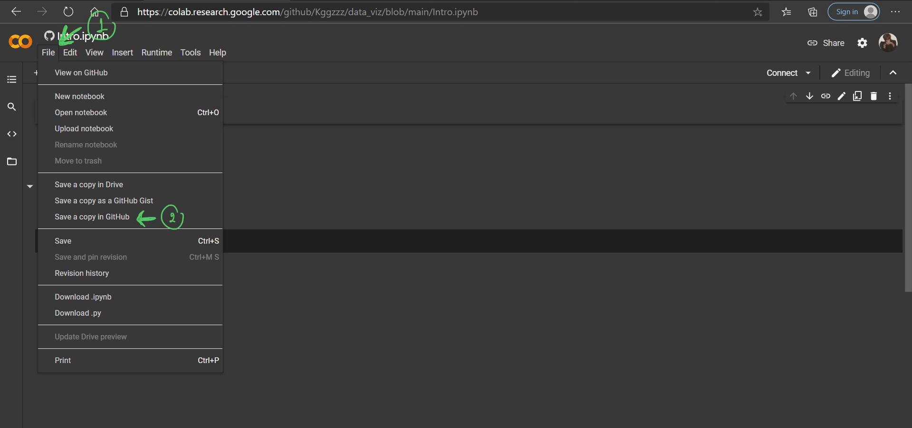

# data_viz

รัฐพร ลีนาราชรุ่งเรือง 613021020-4

#HW
เขียนขั้นตอนการเซฟไฟล์จาก Colab ลงใน github
เขียนขั้นตอนตัวอย่างการอัพโหลดรูปลง 

1.เมื่อพิมงานใน Google Colab เสร็จแล้วให้กดที่คำว่า _File_ จากนั้นเลือกที่คำว่า _Save a coppy in GitHub_

2.เมื่อกดเสร็จแล้วให้เลือกโปรเจคที่ต้องการจะ _Save_ ในครั้งนี้เราจะเลือกเป็น _data_vis_ จากนัั้นตรงช่อง _Commit message_ แล้วตั้งชื่อที่ต้องการจะcommit สุดท้ายจึงกด _OK_ 

ตัวอย่างการแทรกรูป

#HW
เขียนขั้นตอนการแทรก
